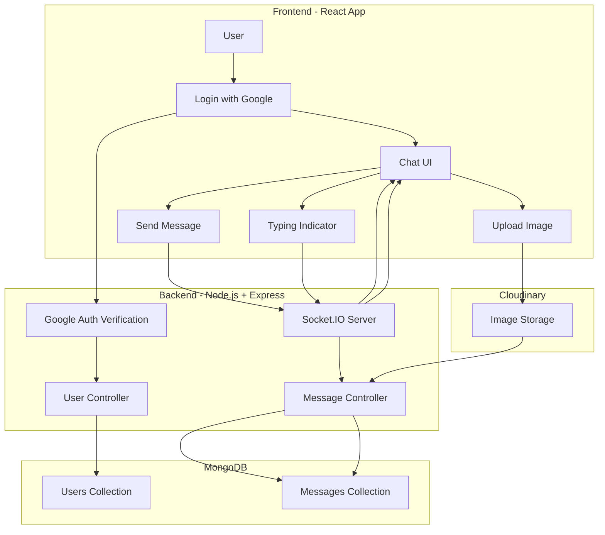

# 💬 Real-Time Chat App

<div align="center">

[](https://react.dev/)
[](https://developer.mozilla.org/en-US/docs/Web/JavaScript)
[](https://tailwindcss.com/)
[](https://www.mongodb.com/)
[](https://socket.io/)
[](https://developers.google.com/identity)
[](https://cloudinary.com/)
[](https://opensource.org/licenses/MIT)

**Ứng dụng Chat thời gian thực với hệ thống xác thực người dùng và cập nhật tức thì**
<br />
🌐 [Xem Demo](https://realtime-chat-app-sa7n.onrender.com/) - 🐞 [Báo Lỗi](https://github.com/SonCryptoz/realtime-chat-app/issues)
</div>

## 📖 Giới thiệu

**Real-Time Chat App** là một ứng dụng web cho phép người dùng nhắn tin theo thời gian thực với trải nghiệm mượt mà và cập nhật tức thì. 

Ứng dụng sử dụng cơ chế **WebSocket - Socket.IO** để truyền tải dữ liệu real-time, kết hợp với **MongoDB, Cloudinary** để lưu trữ tin nhắn, hình ảnh và quản lý xác thực người dùng.

Hệ thống được xây dựng theo kiến trúc **Server - Client**, đảm bảo hiệu năng cao và khả năng mở rộng tốt.

---

## ✨ Tính năng chính

- 💬 **Nhắn tin thời gian thực (Real-time Messaging):** Gửi và nhận tin nhắn ngay lập tức giữa các người dùng thông qua Socket.IO.
- 🔐 **Xác thực người dùng (Authentication):** Đăng ký và đăng nhập bằng Google Authorization, đảm bảo an toàn và tiện lợi.
- 🟢 **Hiển thị trạng thái online/offline:** Cho biết người dùng đang hoạt động hay không theo thời gian thực.
- ✍️ **Typing Indicator:** Hiển thị trạng thái “đang nhập…” khi người khác đang soạn tin nhắn.
- 🕒 **Lưu lịch sử tin nhắn:** Tin nhắn được lưu trữ trong MongoDB, cho phép xem lại các cuộc trò chuyện cũ.
- 🖼️ **Gửi ảnh với Cloudinary:** Hỗ trợ upload và gửi hình ảnh nhanh chóng thông qua Cloudinary.
- 🎨 **Giao diện đa dạng:** Hỗ trợ nhiều theme (Retro, Dark, Cyberpunk, …) nhờ DaisyUI + Tailwind CSS.
---

## 🧠 Kiến trúc hệ thống (Real-time Flow)

---
## 🛠 Công nghệ sử dụng

### Client
- React (Vite)
- Zustand
- Socket.IO (Client)
- Axios
- TailwindCSS + DaisyUI

### Server
- Node.js
- Express
- MongoDB (Mongoose)
- Socket.IO
- JWT Authentication
- Google OAuth
- Cloudinary
---

## 🚀 Cài đặt

### Clone Project

```bash
git clone https://github.com/SonCryptoz/realtime-chat-app.git
cd realtime-chat-app
```

### Local Setup

Client
```bash
cd client
npm i
npm run dev
```

Server
```bash
cd server
npm i
npm run dev
```

### Production Setup

```bash
npm run build
npm start
```

### Tạo file môi trường .env

Client
```bash
VITE_GOOGLE_CLIENT_ID = your_google_client_id
```

Server
```bash
MONGODB_URI = your_mongodb_url
CLIENT_URL = your_app_url

PORT = 5001
JWT_SECRET = my_secret_key # Tạo secret key mạnh trên PRODUCTION

CLOUDINARY_CLOUD_NAME = your_cloud_name
CLOUDINARY_API_KEY = your_api_key
CLOUDINARY_API_SECRET = your_api_secret

GOOGLE_CLIENT_ID = your_id
GOOGLE_CLIENT_SECRET = your_secret

EMAIL_USER = your_email
EMAIL_PASS = your_password

NODE_ENV = development # Không cho lên production vì có auto set
```

### Truy cập

```bash
http://localhost:5173
```
---

## 📁 Cấu trúc thư mục

```txt
chat-app/
│
├── client/                          # React (Vite) Frontend
│   ├── public/                      # Static files
│   ├── src/
│      ├── components/              # UI components (ChatBox, Message, Sidebar, …)
│      ├── constants/               # Hằng số (API URLs, socket events, roles, …)
│      ├── lib/                     # Helper functions, API wrappers
│      ├── pages/                   # Pages (Login, Register, Chat, …)
│      ├── store/                   # Global state management
│      ├── App.jsx                  # Root component
│      ├── main.jsx                 # App entry point
│      ├── App.css
│      └── index.css
│   
│
├── server/                          # Express Backend
│   ├── src/
│      ├── controllers/             # Xử lý logic (auth, message, user, …)
│      ├── lib/                     # DB connection, Cloudinary config, utils
│      ├── middleware/              # Auth middleware, error handler
│      ├── models/                  # Mongoose models (User, Message, …)
│      ├── routes/                  # API routes
│      ├── seeds/                   # Seed dữ liệu mẫu
│      └── index.js                 # Entry point của server
│   
│   
│
├── README.md
└── .gitignore
```
---

## 🎯 Mục tiêu học tập

- [x] **Real-time Communication:** Hiểu và triển khai cơ chế giao tiếp thời gian thực bằng Socket.IO.
- [x] **Authentication & Authorization:** Tích hợp Google Authorization cho đăng nhập/đăng ký và quản lý phiên người dùng an toàn.
- [x] **Fullstack JavaScript:** Xây dựng ứng dụng fullstack với React (frontend) và Express (backend).
- [x] **Database Design:** Thiết kế schema MongoDB cho User và Message, tối ưu việc lưu trữ lịch sử chat.
- [x] **State Management:** Quản lý trạng thái người dùng và socket connection ở phía client.
- [x] **Media Handling:** Upload và quản lý hình ảnh trong chat bằng Cloudinary.
- [x] **UI/UX Modern:** Xây dựng giao diện responsive, hỗ trợ nhiều theme với Tailwind CSS + DaisyUI.
---

## 🧭 Hướng phát triển

💾 **Lưu lịch sử chat theo người dùng:** Mỗi user có lịch sử hội thoại riêng, được đồng bộ giữa nhiều thiết bị khác nhau.

🔐 **Nâng cấp hệ thống xác thực:** Hỗ trợ đăng nhập nhiều nền tảng OAuth (Google, GitHub, ...) và quản lý session bảo mật hơn.

👥 **Chat nhóm & quản lý phòng chat:** Cho phép tạo phòng chat, mời thành viên, phân quyền admin/moderator.

👀 **Trạng thái tin nhắn nâng cao:** Bổ sung các trạng thái: sent, delivered, seen và hiển thị số tin nhắn chưa đọc.

📁 **Hỗ trợ gửi nhiều loại media:** Mở rộng gửi file, video, voice message bên cạnh hình ảnh (Cloudinary).

🔍 **Tìm kiếm & lọc hội thoại:** Tìm kiếm tin nhắn theo nội dung, người gửi hoặc khoảng thời gian.

🌍 **Hỗ trợ đa ngôn ngữ (i18n):** Cho phép người dùng sử dụng giao diện bằng nhiều ngôn ngữ khác nhau.

🎨 **Cá nhân hóa trải nghiệm người dùng**  

**Dựa trên:**
- Theme ưa thích  
- Danh sách bạn bè  
- Hành vi tương tác  
- Lịch sử trò chuyện  
---

## 🙏 Lời cảm ơn

Dự án này không thể hoàn thiện nếu thiếu sự hỗ trợ từ các công cụ và nền tảng sau:

- **MongoDB** – Hệ quản trị cơ sở dữ liệu NoSQL dùng để lưu trữ thông tin người dùng và lịch sử tin nhắn.  
- **Socket.IO** – Thư viện giúp triển khai giao tiếp thời gian thực giữa client và server.  
- **Google Identity** – Dịch vụ xác thực người dùng thông qua Google Authorization.  
- **Cloudinary** – Nền tảng lưu trữ và xử lý hình ảnh được gửi trong quá trình chat.  
- **React & Tailwind CSS** – Nền tảng xây dựng giao diện người dùng hiện đại, responsive và dễ mở rộng.

Ngoài ra, xin gửi lời cảm ơn đến cộng đồng **Open Source** và các tác giả blog, tutorial về:

- **Real-time Web Application**  
- **WebSocket / Socket.IO**  
- **Authentication & Authorization**  
- **Fullstack JavaScript Development**

Những tài liệu và ví dụ thực tế từ cộng đồng đã góp phần quan trọng trong việc xây dựng và hoàn thiện dự án này. ❤️