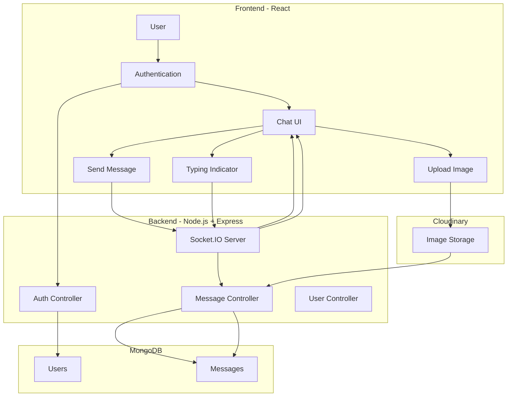

# Real-Time Chat App

<div align="center">

[](https://react.dev/)
[](https://developer.mozilla.org/en-US/docs/Web/JavaScript)
[](https://tailwindcss.com/)
[](https://www.mongodb.com/)
[](https://socket.io/)
[](https://developers.google.com/identity)
[](https://cloudinary.com/)
[](https://opensource.org/licenses/MIT)

**Ứng dụng chat thời gian thực được xây dựng với React và Node.js**

[Demo](https://realtime-chat-app-sa7n.onrender.com/) · [Báo lỗi](https://github.com/SonCryptoz/realtime-chat-app/issues)

</div>

## Giới thiệu

**Real-Time Chat App** là ứng dụng web chat cho phép người dùng gửi và nhận tin nhắn theo thời gian thực.

Ứng dụng được xây dựng theo mô hình **client-server**, sử dụng **React** cho frontend và **Node.js + Express** cho backend. **Socket.IO** đảm nhiệm việc giao tiếp thời gian thực giữa client và server, trong khi **MongoDB** được sử dụng để lưu trữ thông tin người dùng và lịch sử tin nhắn.

Ứng dụng cũng tích hợp **Google OAuth** cho xác thực người dùng và **Cloudinary** để lưu trữ hình ảnh được gửi trong cuộc trò chuyện.

## Tính năng

### Chat

* Gửi và nhận tin nhắn theo thời gian thực.
* Hiển thị trạng thái online/offline của người dùng.
* Typing indicator khi người dùng đang nhập tin nhắn.
* Lưu và hiển thị lịch sử cuộc trò chuyện.
* Gửi hình ảnh trong tin nhắn thông qua Cloudinary.
* Giao diện responsive và hỗ trợ nhiều theme.

### Authentication

* Đăng ký và đăng nhập tài khoản.
* Đăng nhập thông qua Google OAuth.
* Xác thực request phía server bằng JWT.
* Quản lý trạng thái người dùng và phiên đăng nhập.

## Kiến trúc hệ thống



## Công nghệ

### Frontend

* **React 19** – Xây dựng giao diện người dùng.
* **Vite** – Development server và build tool.
* **Zustand** – Quản lý global state.
* **Socket.IO Client** – Kết nối real-time với server.
* **Axios** – Gửi HTTP request đến backend.
* **Tailwind CSS + DaisyUI** – Xây dựng giao diện và theme.

### Backend

* **Node.js** – Runtime cho backend.
* **Express** – Xây dựng REST API.
* **MongoDB + Mongoose** – Database và ODM.
* **Socket.IO** – Real-time communication.
* **JWT** – Xác thực request.
* **Google OAuth** – Đăng nhập bằng tài khoản Google.
* **Cloudinary** – Upload và lưu trữ hình ảnh.

## Cấu trúc thư mục

```text
realtime-chat-app/
│
├── client/                         # React frontend
│   ├── public/                     # Static assets
│   └── src/
│       ├── components/             # UI components
│       ├── constants/              # Constants và socket events
│       ├── lib/                    # API wrappers và helper functions
│       ├── pages/                  # Login, Register, Chat...
│       ├── store/                  # Zustand stores
│       ├── App.jsx
│       ├── main.jsx
│       ├── App.css
│       └── index.css
│
├── server/                         # Node.js + Express backend
│   └── src/
│       ├── controllers/            # Business logic
│       ├── lib/                    # Database, Cloudinary và utilities
│       ├── middleware/             # Authentication và error handling
│       ├── models/                 # Mongoose models
│       ├── routes/                 # REST API routes
│       ├── seeds/                  # Sample data
│       └── index.js                # Server entry point
│
├── README.md
└── .gitignore
```

## Cài đặt

### 1. Clone repository

```bash
git clone https://github.com/SonCryptoz/realtime-chat-app.git
cd realtime-chat-app
```

### 2. Cài đặt dependencies

Frontend:

```bash
cd client
npm install
```

Backend:

```bash
cd ../server
npm install
```

### 3. Cấu hình environment variables

Tạo file `.env` trong thư mục `client`:

```env
VITE_GOOGLE_CLIENT_ID=your_google_client_id
```

Tạo file `.env` trong thư mục `server`:

```env
MONGODB_URI=your_mongodb_url
CLIENT_URL=http://localhost:5173

PORT=5001
JWT_SECRET=your_secret_key

CLOUDINARY_CLOUD_NAME=your_cloud_name
CLOUDINARY_API_KEY=your_api_key
CLOUDINARY_API_SECRET=your_api_secret

GOOGLE_CLIENT_ID=your_google_client_id
GOOGLE_CLIENT_SECRET=your_google_client_secret

EMAIL_USER=your_email
EMAIL_PASS=your_password

NODE_ENV=development
```

Không commit các file `.env` hoặc secret credentials vào repository.

### 4. Chạy development server

Frontend:

```bash
cd client
npm run dev
```

Backend:

```bash
cd server
npm run dev
```

Frontend mặc định chạy tại:

```text
http://localhost:5173
```

Backend chạy tại port được cấu hình trong `PORT`.

### 5. Production build

```bash
cd client
npm run build
```

Sau khi build, có thể triển khai frontend và backend lên các nền tảng hosting phù hợp.

## Những gì đã học được

Thông qua dự án này, tôi có cơ hội thực hành:

* Xây dựng ứng dụng fullstack với React, Node.js và Express.
* Triển khai giao tiếp thời gian thực bằng Socket.IO.
* Thiết kế API và xử lý request giữa frontend và backend.
* Thiết kế schema MongoDB bằng Mongoose.
* Xây dựng hệ thống authentication với JWT và Google OAuth.
* Quản lý global state bằng Zustand.
* Xử lý kết nối và trạng thái của Socket.IO ở phía client.
* Upload và quản lý hình ảnh với Cloudinary.
* Xây dựng giao diện responsive và hệ thống theme với Tailwind CSS và DaisyUI.
* Tổ chức source code theo cấu trúc frontend/backend riêng biệt.

## Hướng phát triển

Một số tính năng có thể được bổ sung trong tương lai:

* Đồng bộ lịch sử chat giữa nhiều thiết bị.
* Hỗ trợ đăng nhập thêm các nền tảng OAuth như GitHub.
* Chat nhóm và quản lý phòng chat.
* Trạng thái tin nhắn `sent`, `delivered`, `seen`.
* Hiển thị số lượng tin nhắn chưa đọc.
* Hỗ trợ gửi file, video và voice message.
* Tìm kiếm tin nhắn và cuộc trò chuyện.
* Hỗ trợ đa ngôn ngữ.
* Cải thiện hệ thống notification và quản lý trạng thái người dùng.

## Lời cảm ơn

Dự án này không thể hoàn thiện nếu thiếu sự hỗ trợ từ các công cụ và nền tảng sau:

- **MongoDB** – Hệ quản trị cơ sở dữ liệu NoSQL dùng để lưu trữ thông tin người dùng và lịch sử tin nhắn.  
- **Socket.IO** – Thư viện giúp triển khai giao tiếp thời gian thực giữa client và server.  
- **Google Identity** – Dịch vụ xác thực người dùng thông qua Google Authorization.  
- **Cloudinary** – Nền tảng lưu trữ và xử lý hình ảnh được gửi trong quá trình chat.  
- **React & Tailwind CSS** – Nền tảng xây dựng giao diện người dùng hiện đại, responsive và dễ mở rộng.

Ngoài ra, xin gửi lời cảm ơn đến cộng đồng **Open Source** và các tác giả blog, tutorial về:

- **Real-time Web Application**  
- **WebSocket / Socket.IO**  
- **Authentication & Authorization**  
- **Fullstack JavaScript Development**

Những tài liệu và ví dụ thực tế từ cộng đồng đã góp phần quan trọng trong việc xây dựng và hoàn thiện dự án này. ❤️
